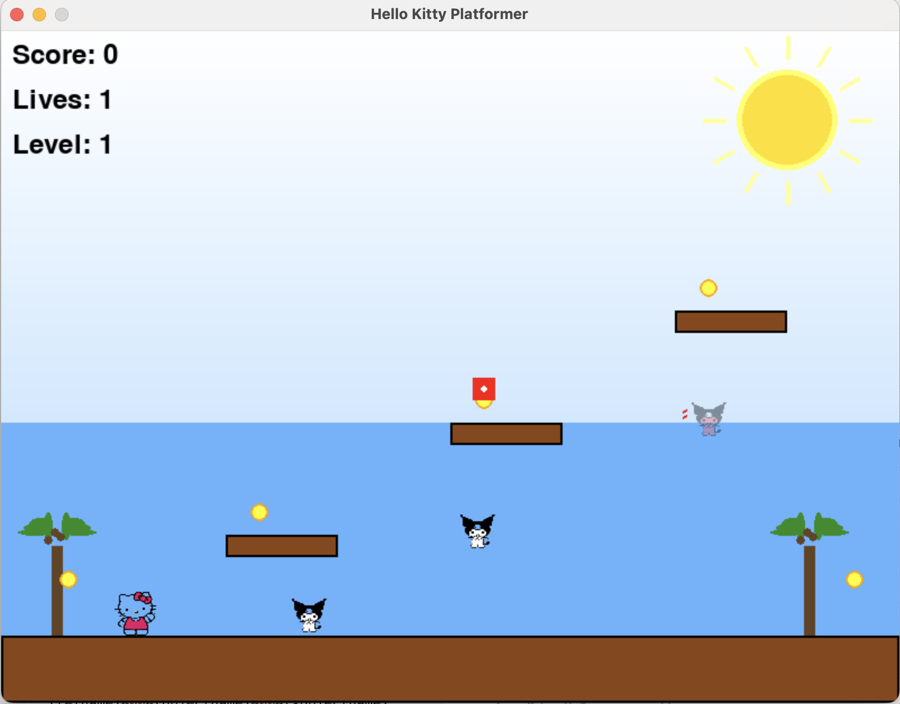
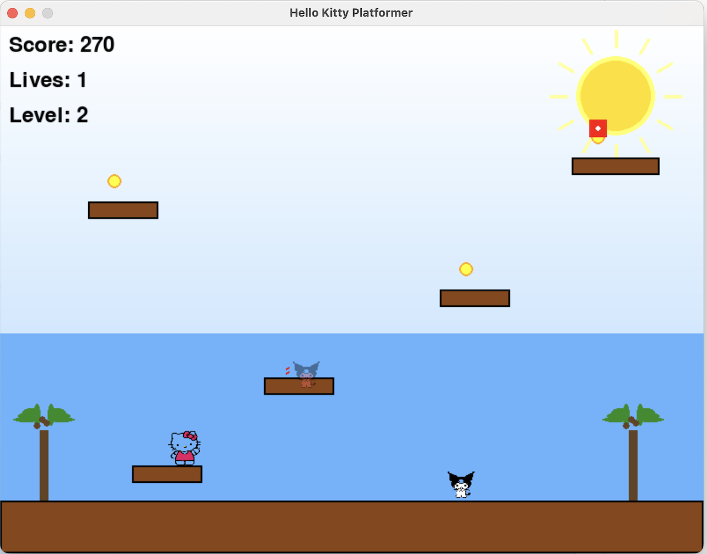
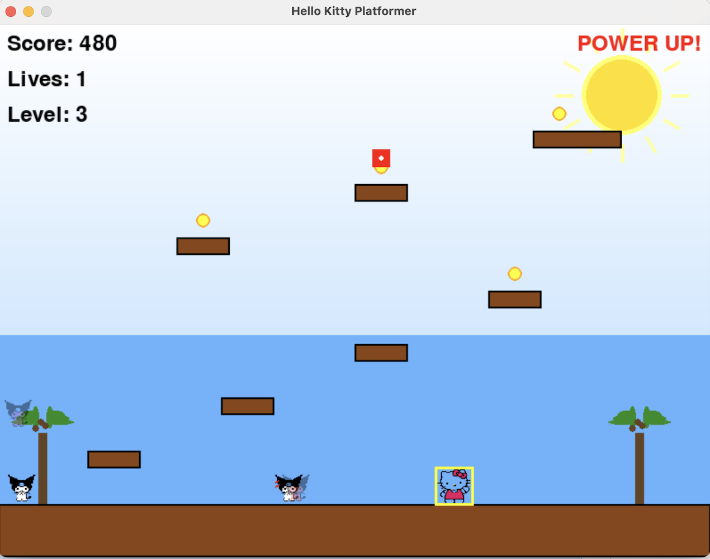
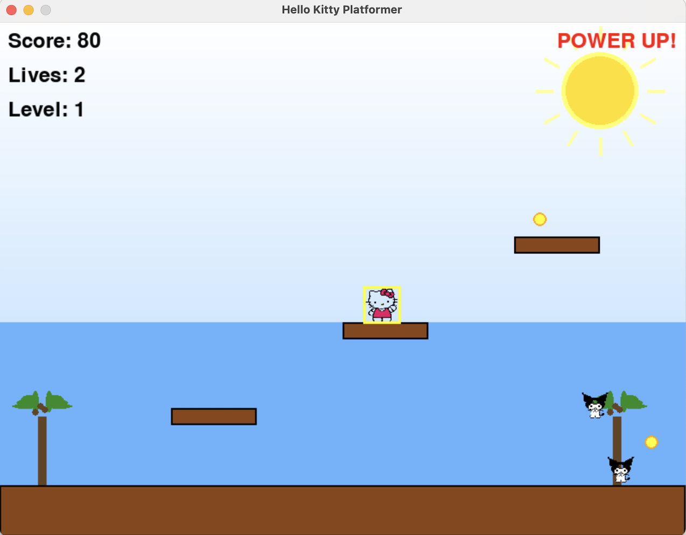
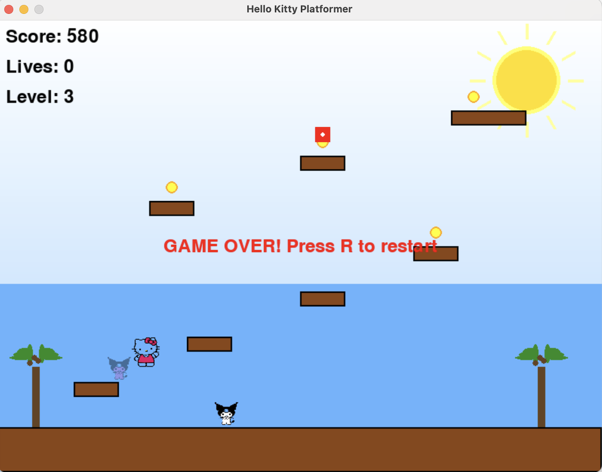

# 🐱 Hello Kitty Platformer Game

A delightful 2D platformer game featuring Hello Kitty in a beautiful coastal adventure! Navigate through multiple levels, collect coins, avoid enemies, and enjoy the charming graphics.

## 🎮 Game Features

### Two Game Modes
- **Basic Game** (`hello_kitty_game.py`) - Simple platformer with basic mechanics
- **Advanced Platformer** (`hello_kitty_platformer.py`) - Full-featured game with multiple levels, power-ups, and coastal theme

### Advanced Game Features
- **3 Challenging Levels** with increasing difficulty
- **Beautiful Coastal Theme** with animated background, palm trees, and ocean waves
- **Character Sprites** - Authentic Hello Kitty and Kiromi (enemy) images
- **Power-ups** - Speed boost and invincibility
- **Collectibles** - Coins to collect for points
- **Multiple Enemy Types** - Normal, fast, and jumping enemies
- **Lives System** - 3 lives with invincibility frames after taking damage
- **Score System** - Earn points by collecting coins
- **Smooth Controls** - Responsive movement and jumping mechanics

## 🎯 How to Play

### Controls
- **Arrow Keys** - Move left and right
- **Spacebar** - Jump
- **R** - Restart game (when game over or level complete)

### Objective
- Collect all coins in each level to progress
- Avoid the Kiromi enemies (they will make you lose a life)
- Complete all 3 levels to win the game
- Try to achieve the highest score possible!

## 🚀 Installation & Setup

### Prerequisites
- Python 3.7 or higher
- pip (Python package installer)

### Installation Steps

1. **Clone the repository**
   ```bash
   git clone https://github.com/utkarsh2020/HelloKittyGame.git
   cd HelloKittyGame
   ```

2. **Install dependencies**
   ```bash
   pip install -r requirements.txt
   ```

3. **Run the game**
   
   For the basic version:
   ```bash
   python hello_kitty_game.py
   ```
   
   For the advanced platformer:
   ```bash
   python hello_kitty_platformer.py
   ```

## 📁 Project Structure

```
HelloKittyGame/
├── hello_kitty_game.py          # Basic platformer game
├── hello_kitty_platformer.py    # Advanced platformer with levels
├── hello kitty.png              # Hello Kitty character sprite
├── kiromi.png                   # Enemy character sprite
├── requirements.txt             # Python dependencies
└── README.md                    # This file
```

## 🎨 Screenshots

### Game Menu & Level 1

*Hello Kitty starting her coastal adventure in Level 1*

### Level 2 - Increased Difficulty

*More challenging platforms and enemies in Level 2*

### Level 3 - Final Challenge

*The ultimate test with multiple enemy types and complex platforming*

### Power-up Mode

*Hello Kitty with speed boost power-up activated*

### Game Over Screen

*Game over screen with restart option*

## 🛠️ Technical Details

### Built With
- **Python 3.x** - Programming language
- **Pygame 2.5.2** - Game development library
- **Custom Graphics** - Hello Kitty and Kiromi character sprites

### Game Architecture
- **Object-Oriented Design** - Separate classes for Player, Enemies, Platforms, and Game logic
- **Collision Detection** - Precise rectangle-based collision system
- **Animation System** - Smooth character animations and background effects
- **Level System** - Modular level design with configurable platforms and enemies

### Performance
- **60 FPS** - Smooth gameplay experience
- **Optimized Rendering** - Efficient sprite drawing and background rendering
- **Memory Management** - Proper resource cleanup and object management

## 🎮 Gameplay Tips

1. **Master the Jump Timing** - Learn when to jump to avoid enemies and reach platforms
2. **Collect All Coins** - You need all coins to complete each level
3. **Use Power-ups Wisely** - Speed boosts can help you escape dangerous situations
4. **Watch Enemy Patterns** - Different enemies have different movement patterns
5. **Take Advantage of Invincibility** - After taking damage, use the brief invincibility period to pass through enemies

## 🐛 Known Issues

- Game window must remain in focus for proper input handling
- Character sprites require PNG files to be in the same directory

## 🔄 Future Enhancements

- [ ] Add sound effects and background music
- [ ] Implement more power-up types
- [ ] Add boss battles at the end of each level
- [ ] Create a level editor for custom levels
- [ ] Add multiplayer support
- [ ] Implement save/load game functionality

## 🤝 Contributing

Feel free to fork this project and submit pull requests! Some areas where contributions would be welcome:

- New level designs
- Additional character sprites
- Sound effects and music
- Bug fixes and optimizations
- New game features

## 📄 License

This project is open source and available under the [MIT License](LICENSE).

## 🙏 Acknowledgments

- Hello Kitty character design by Sanrio
- Pygame community for excellent documentation and examples
- Coastal theme inspiration from tropical platformer games

---

**Enjoy playing the Hello Kitty Platformer! 🐱✨**

For questions or support, please open an issue on GitHub.
